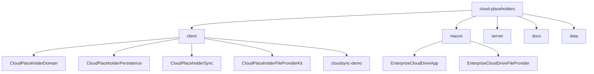

# Enterprise Cloud Placeholder Sync v1

## 项目愿景

面向企业知识工作者的 macOS 原生文件同步产品原型。核心目标是验证 Finder 占位符目录、基于 SQLite 的增量同步、以及最小可用 Control Plane + Data Plane mock API 三件事。当前处于 v1 原型阶段，以文件级同步正确性优先。

## 架构总览

系统采用四层架构：

- **Domain 层** (`client/Sources/CloudPlaceholderDomain`)：纯 Swift 定义所有共享领域模型、协议与错误类型，零外部依赖
- **Persistence 层** (`client/Sources/CloudPlaceholderPersistence`)：基于原始 SQLite C API（`@_silgen_name`）的 `MetadataStore` 实现，含 5 张核心表（items、sync_state、pending_ops、transfers、content_cache）
- **Sync 层** (`client/Sources/CloudPlaceholderSync`)：`SyncEngine` 编排增量拉取/按需下载/上传/驱逐流程；`HTTPRemoteAPIClient` 负责与服务端 HTTP 通信
- **FileProvider 桥接层** (`client/Sources/CloudPlaceholderFileProviderKit`)：实现 `NSFileProviderItem`、`NSFileProviderEnumerator`、`ProviderDomainController`，可嵌入 Xcode File Provider Extension target
- **macOS App** (`macos/`)：菜单栏主应用 + File Provider Extension，通过 App Group 共享容器与 UserDefaults 通信
- **Mock Server** (`server/`)：无外部依赖的 Node.js 单进程 HTTP 服务，提供设备注册、变更游标、元数据 CRUD、内容上传下载、审计查询

关键数据流：Finder/本地应用 -> FileProviderExtension -> ProviderDomainController -> SyncEngine -> HTTPRemoteAPIClient -> mock-server。同步状态通过 SQLite 持久化，缓存文件存放在共享容器的 cache/ 目录。

## 模块结构图



## 模块索引

| 模块 | 路径 | 语言 | 职责 |
|------|------|------|------|
| client | `client/` | Swift 6.1 | 核心同步库：领域模型、SQLite 持久化、同步引擎、FileProvider 桥接、CLI demo |
| macos | `macos/` | Swift / Xcode | macOS 菜单栏应用 + File Provider Extension 工程 |
| server | `server/` | Node.js (ESM) | 无外部依赖的 mock HTTP 服务端 |
| docs | `docs/` | Markdown | 产品设计、接口契约、架构图、开发手册 |
| data | `data/` | JSON / Binary | mock server 持久化数据（server-state.json、blob-store） |

## 运行与开发

### 前置条件

- macOS 15+（Swift 6.1 工具链）
- Node.js 18+（内置 test runner）
- Xcode（用于 macOS App 构建）

### 常用命令

```bash
# 跑客户端测试
cd client && swift test --disable-sandbox

# 跑服务端测试
cd server && node --test mock-server.test.mjs

# 启动 mock server（端口 8787）
cd server && node mock-server.mjs

# 运行客户端 demo（需先启动 mock server）
cd client && MOCK_SERVER_URL=http://127.0.0.1:8787 swift run cloudsync-demo --disable-sandbox

# 构建 macOS App + File Provider Extension
cd macos && xcodebuild -project EnterpriseCloudDrive.xcodeproj -scheme EnterpriseCloudDrive -configuration Debug CODE_SIGNING_ALLOWED=NO build
```

### mock server 端点

- 健康检查：`GET http://127.0.0.1:8787/health`
- 管理控制台：`GET http://127.0.0.1:8787/admin`
- API 前缀：`/api/`（详见 `docs/api-contract.md`）

### 环境变量

| 变量 | 说明 | 默认值 |
|------|------|--------|
| `MOCK_SERVER_URL` | mock server 基地址（CLI demo 使用） | 无（不设置则仅初始化本地库） |
| `PORT` | mock server 监听端口 | `8787` |

## 测试策略

- **客户端**：使用 Swift Testing 框架（`@Test` / `#expect`），两个测试 target：
  - `CloudPlaceholderPersistenceTests`：验证 SQLite 持久化（CRUD、缓存统计、驱逐候选、待处理操作）
  - `CloudPlaceholderSyncTests`：验证同步引擎（远端变更拉取、本地文件暂存上传、冷文件驱逐），使用 in-memory `RemoteAPIStub` mock
- **服务端**：使用 Node.js 内置 `node:test` 模块，测试状态辅助函数（设备注册、二进制上传、变更批构建）
- **macOS App**：当前无自动化测试，依赖手动联调

## 编码规范

- **Swift**：Swift 6.1，严格并发（`Sendable`），`@_silgen_name` 绑定 SQLite C API，协议驱动设计（`MetadataStore` / `RemoteAPIClient`）
- **Node.js**：ESM 模块（`"type": "module"`），零外部依赖，仅使用 Node.js 内置模块
- **数据库**：SQLite，手写 DDL（5 表 + 索引），通过 `DispatchQueue` 串行化访问
- **错误处理**：自定义 `CloudPlaceholderError` 枚举统一错误类型
- **系统文件过滤**：`IgnoredSystemFileMatcher` 过滤 `.DS_Store`、`._*`、`~$*`、`.swp`、`.tmp`

## AI 使用指引

- 修改领域模型时，同步更新 `DomainModels.swift`、`Schema.swift`（DDL）、`SQLiteStore.swift`（CRUD SQL）、`mock-server.mjs`（状态结构）
- 添加新 API 端点时，需同步更新 `api-contract.md`、`HTTPRemoteAPIClient`、`mock-server.mjs` 路由
- `SQLiteBridge.swift` 中的 C 绑定是底层基础设施，除非需要新增 SQLite 函数否则不应修改
- `PlaceholderFileProviderBridge.swift` 中的 `ProviderDomainController` 是 Extension 与 Sync 层的桥梁，新增 Finder 交互需从这里入手
- 测试应优先使用 stub/mock 模式（参考 `SyncEngineTests.swift` 中的 `RemoteAPIStub`）

## 变更记录 (Changelog)

| 时间 | 操作 | 说明 |
|------|------|------|
| 2026-04-22T21:54:18 | 初始化 | 首次生成 CLAUDE.md 与各模块文档，覆盖率 100% |
