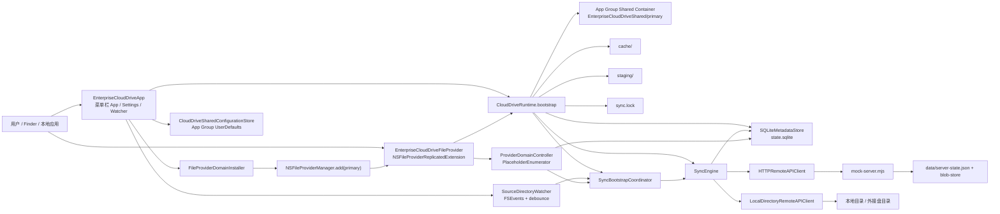
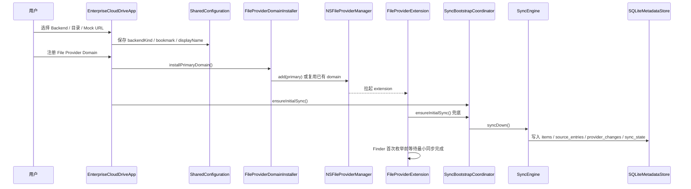
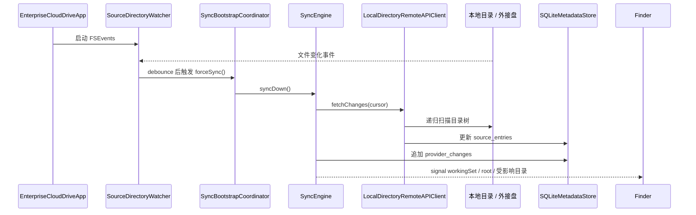
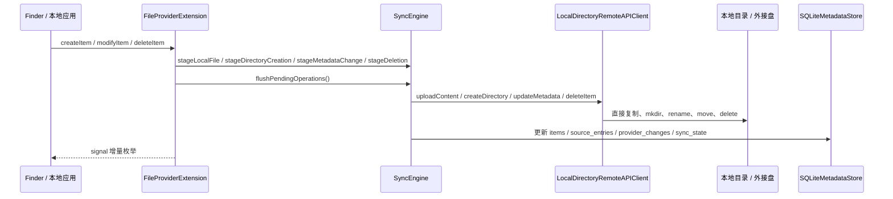
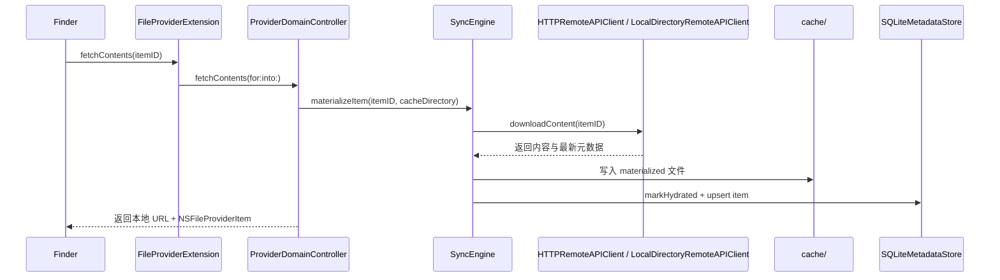

# Enterprise Cloud Placeholder Sync v1 架构图

这份文档描述的是仓库当前已经落地的实现结构。

## 当前实现架构图

## 关键流转图

### 1. 启动、注册与首轮同步

### 2. Local Directory 扫描与回放

### 3. Finder 写入回写源目录

### 4. 按需 materialize

## 当前关键点

- 首轮同步已经接入 App 启动与 Extension 启动兜底，不再要求用户先手工点一次同步
- `sync.lock` 用于串行化 App 与 appex 对同一 `state.sqlite` 的写入
- `workingSetCursor` 明确作为 File Provider 增量锚点，不再复用 `remoteCursor`
- `provider_changes` 负责 working set 与父目录增量枚举，删除会级联记录整棵子树
- `Local Directory` watcher 常驻在菜单栏 App，Extension 只做被系统拉起时的兜底同步

## 代码映射

- App:
  - [EnterpriseCloudDriveApp.swift](/Users/peiel/Project/cloud-placeholders/macos/EnterpriseCloudDriveApp/EnterpriseCloudDriveApp.swift)
  - [SourceDirectoryWatcher.swift](/Users/peiel/Project/cloud-placeholders/macos/EnterpriseCloudDriveApp/SourceDirectoryWatcher.swift)
  - [FileProviderDomainInstaller.swift](/Users/peiel/Project/cloud-placeholders/macos/EnterpriseCloudDriveApp/FileProviderDomainInstaller.swift)
- Shared runtime / sync:
  - [CloudDriveSharedRuntime.swift](/Users/peiel/Project/cloud-placeholders/client/Sources/CloudPlaceholderSync/CloudDriveSharedRuntime.swift)
  - [SyncEngine.swift](/Users/peiel/Project/cloud-placeholders/client/Sources/CloudPlaceholderSync/SyncEngine.swift)
  - [LocalDirectoryRemoteAPIClient.swift](/Users/peiel/Project/cloud-placeholders/client/Sources/CloudPlaceholderSync/LocalDirectoryRemoteAPIClient.swift)
- Persistence / File Provider:
  - [Schema.swift](/Users/peiel/Project/cloud-placeholders/client/Sources/CloudPlaceholderDomain/Schema.swift)
  - [SQLiteStore.swift](/Users/peiel/Project/cloud-placeholders/client/Sources/CloudPlaceholderPersistence/SQLiteStore.swift)
  - [PlaceholderFileProviderBridge.swift](/Users/peiel/Project/cloud-placeholders/client/Sources/CloudPlaceholderFileProviderKit/PlaceholderFileProviderBridge.swift)
  - [FileProviderExtension.swift](/Users/peiel/Project/cloud-placeholders/macos/EnterpriseCloudDriveFileProvider/FileProviderExtension.swift)
- Mock backend:
  - [mock-server.mjs](/Users/peiel/Project/cloud-placeholders/server/mock-server.mjs)
