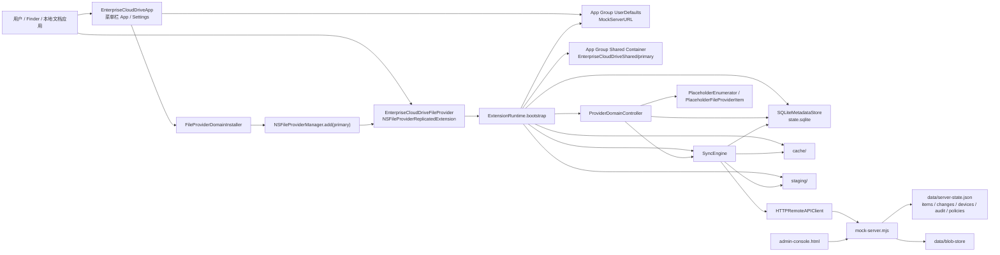
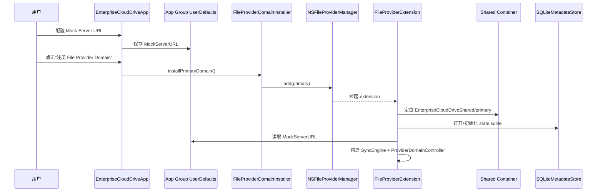
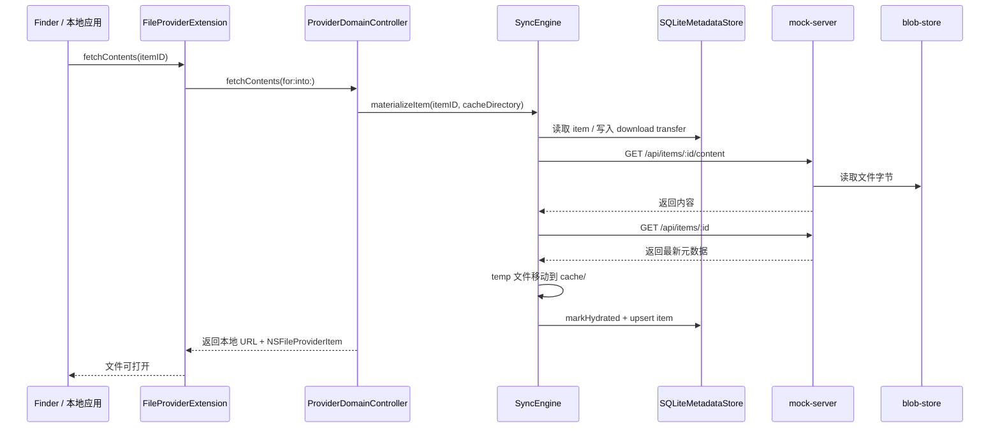
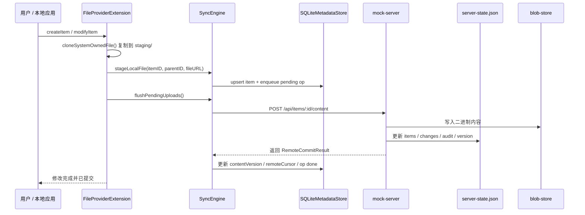
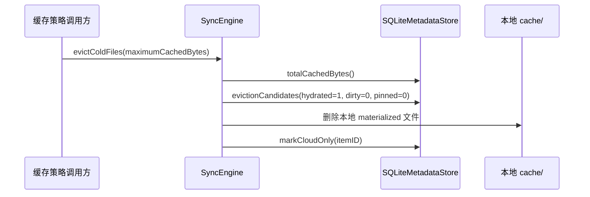

# Enterprise Cloud Placeholder Sync v1 架构图

这份文档描述的是当前仓库里已经落地的实现结构，不是未来完整产品的目标态蓝图。

## 当前实现架构图

## 关键流转图

### 1. 启动与挂载

### 2. 按需下载

### 3. 本地修改上传

### 4. 冷文件驱逐

## 当前态与目标态差距

- 已打通：
  - App 侧 domain 注册
  - Extension 启动与共享运行时初始化
  - 文件内容按需下载
  - 本地文件修改后上传
  - 基于 SQLite 的缓存与驱逐状态管理
- 还未完全打通：
  - `syncDown()` 尚未自动接入 App 或 Extension 的首轮同步流程
  - 设备注册 `register(device)` 已在同步层实现，但尚未接进 macOS 主链路
  - 目录创建、删除、重命名、移动还没有完整的远端元数据闭环
  - 自动驱逐逻辑已实现，但还没有接成常驻后台调度
  - Finder 真实占位符体验仍需带 entitlement 的安装运行验证

## 代码映射

- App:
  - [EnterpriseCloudDriveApp.swift](/Users/peiel/Documents/Codex/2026-04-17-icloud-onedrive-cloud-placeholders-1-the/macos/EnterpriseCloudDriveApp/EnterpriseCloudDriveApp.swift)
  - [FileProviderDomainInstaller.swift](/Users/peiel/Documents/Codex/2026-04-17-icloud-onedrive-cloud-placeholders-1-the/macos/EnterpriseCloudDriveApp/FileProviderDomainInstaller.swift)
- File Provider:
  - [FileProviderExtension.swift](/Users/peiel/Documents/Codex/2026-04-17-icloud-onedrive-cloud-placeholders-1-the/macos/EnterpriseCloudDriveFileProvider/FileProviderExtension.swift)
  - [PlaceholderFileProviderBridge.swift](/Users/peiel/Documents/Codex/2026-04-17-icloud-onedrive-cloud-placeholders-1-the/client/Sources/CloudPlaceholderFileProviderKit/PlaceholderFileProviderBridge.swift)
- Sync:
  - [SyncEngine.swift](/Users/peiel/Documents/Codex/2026-04-17-icloud-onedrive-cloud-placeholders-1-the/client/Sources/CloudPlaceholderSync/SyncEngine.swift)
  - [SQLiteStore.swift](/Users/peiel/Documents/Codex/2026-04-17-icloud-onedrive-cloud-placeholders-1-the/client/Sources/CloudPlaceholderPersistence/SQLiteStore.swift)
- Server:
  - [mock-server.mjs](/Users/peiel/Documents/Codex/2026-04-17-icloud-onedrive-cloud-placeholders-1-the/server/mock-server.mjs)
  - [admin-console.html](/Users/peiel/Documents/Codex/2026-04-17-icloud-onedrive-cloud-placeholders-1-the/server/admin-console.html)
